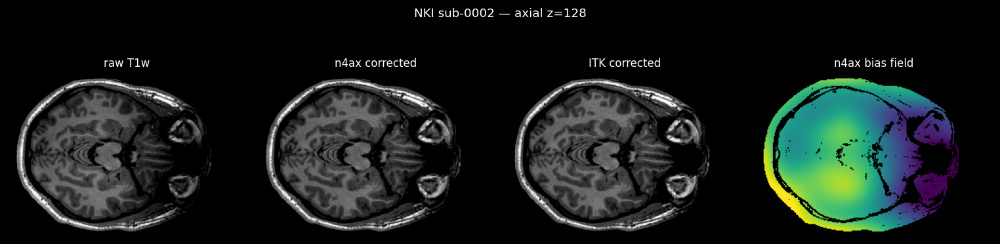
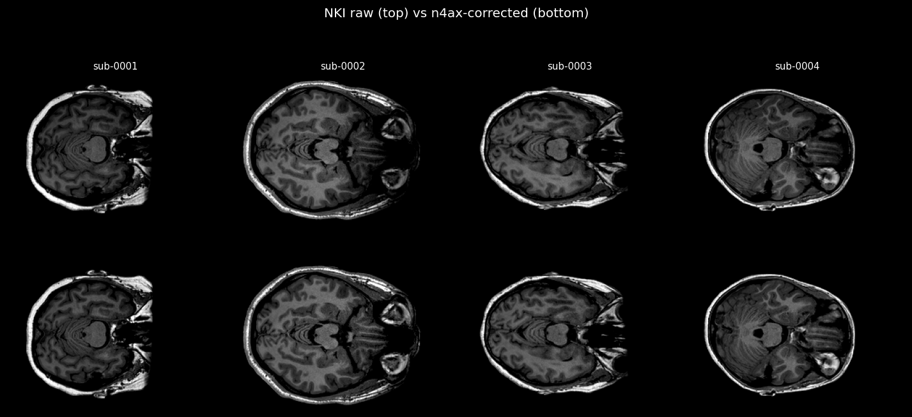

# n4ax

**N4 bias field correction in pure JAX** — a fast, GPU-friendly, *drop-in* match for
ITK / SimpleITK's `N4BiasFieldCorrectionImageFilter`.

n4ax reimplements the N4 algorithm (Tustison et al., 2010 — N3 histogram sharpening
+ multi-resolution B-spline) faithfully enough to **match SimpleITK to ~1%** on real
MRI, while running **~1500× faster on a GPU** and **~20× faster on the same CPU**.


*Raw NKI T1w (with B1 shading) → n4ax-corrected → ITK-corrected (visually identical) → estimated bias field.*

## Why

N4 is the de-facto standard bias correction, but ITK's implementation is CPU-only and
slow (minutes per volume). In a GPU MRI pipeline it becomes the bottleneck. n4ax gives
**N4-quality output on the GPU in tens of milliseconds**, with no custom CUDA — just JAX.

## Install

From PyPI:

```bash
uv pip install "n4ax[cuda12]"     # GPU (CUDA 12)
uv pip install "n4ax[cpu]"        # CPU
uv pip install n4ax               # base (bring your own JAX)
# pip works too: pip install "n4ax[cuda12]"
```

From source (development), with [uv](https://docs.astral.sh/uv/):

```bash
git clone https://github.com/GragasLab/n4ax && cd n4ax
uv sync --extra cuda12 --extra dev      # + tests/linting
uv sync --extra cuda12 --extra compare  # + SimpleITK/matplotlib for benchmarks
```

## Usage

```python
import nibabel as nib
import n4ax

vol = nib.load("t1w.nii.gz").get_fdata()      # 3D (or 2D) array, intensities >= 0
corrected = n4ax.n4(vol)                        # Otsu mask computed automatically
# or pass your own mask, and/or get the log bias field:
corrected, log_bias = n4ax.n4(vol, mask=mask, return_bias=True)
```

`corrected == vol / exp(log_bias)`. The default config (`iters=(8,12,12,8)`,
`over_relax=1.8`) is tuned for speed; for the tightest ITK match use the robust
fallback `n4ax.n4(vol, iters=(50,50,30,20), over_relax=1.0, conv_threshold=1.5e-3)`.

## Benchmark

Real NKI T1w volumes (256×176×256, ~2 M brain voxels), N4 `[50,50,30,20]`, same Otsu mask.
ITK on an 8-core CPU; n4ax CPU on the same node; n4ax GPU on an NVIDIA A100.

| Method | Time / volume | Speedup vs ITK |
|---|--:|--:|
| ITK N4 (CPU, 8 cores) | **146 s** | 1× |
| n4ax (CPU, 8 cores) | **7.7 s** | **~19×** |
| n4ax (A100 GPU) | **93 ms** | **~1571×** |

**Accuracy vs ITK** (corrected image, global scale removed — pipelines intensity-normalise anyway):
mean **1.15 %**, per-subject 0.79–1.59 % over 6 NKI scans. On a single fitting level n4ax
matches ITK to **0.4 %**, and a single N4 iteration to **0.1 %** — the building blocks are exact;
the residual is N4's own iterative crawl (ITK itself only converges after ~30 iters/level).

Multiple subjects, raw (top) vs n4ax-corrected (bottom):



Reproduce: `python scripts/bench_nki.py` (GPU) and `JAX_PLATFORMS=cpu python scripts/bench_nki.py --skip-itk --skip-fig --tag cpu`.

## How it's fast (no custom kernels)

- **Separable B-spline fit.** N4's per-iteration B-spline least-squares (Lee MBA) is a
  94 M-way scatter into a tiny control lattice — brutal atomic contention (~30 ms/iter).
  Because the cubic weights depend only on the per-axis index and the Lee denominator
  factorises, this becomes **3 small dense matmuls per axis** (cuBLAS) — *identical math*,
  0.1 ms/iter.
- **Privatised histogram.** The N3 sharpening histogram (1.5 M → 200 bins) is privatised
  over 256 lanes to avoid atomic serialisation.
- **Over-relaxation.** N4's fixed point is invariant to `B += α·S` (S = 0 there), so
  `α ≈ 1.8` reaches ITK's result in far fewer iterations.
- The whole solve is one fused, jitted program with a device-side convergence loop.

Two things that mattered for *correctness*: zero-padding the sharpening FFT (circular
wraparound otherwise breaks convergence), and that float32 == float64 here (verified).

## Tests

```bash
uv run pytest          # basic correctness + ground-truth match vs SimpleITK
```

`tests/test_vs_itk.py` asserts n4ax matches SimpleITK's N4 (the reference) within tolerance
on a phantom; `tests/test_basic.py` covers shapes, 2D/3D, the `image/exp(bias)` identity,
bias flattening, and the Otsu mask.

## Status

Alpha. The fast defaults are tuned on NKI/phantom data; validate on your own data before
production (the `iters=(50,50,30,20), over_relax=1.0` fallback is the conservative choice).
